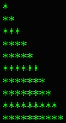
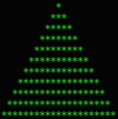
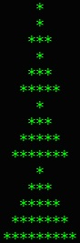
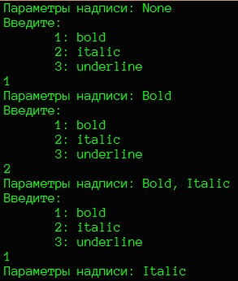
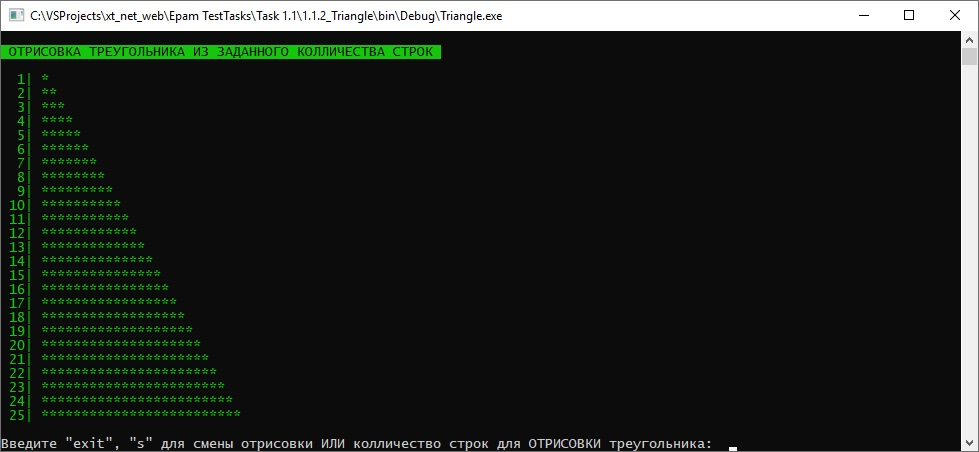
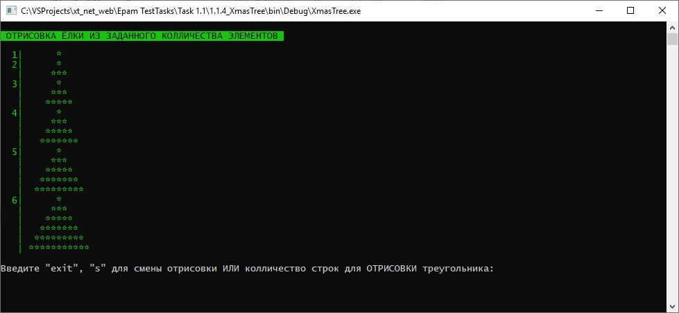
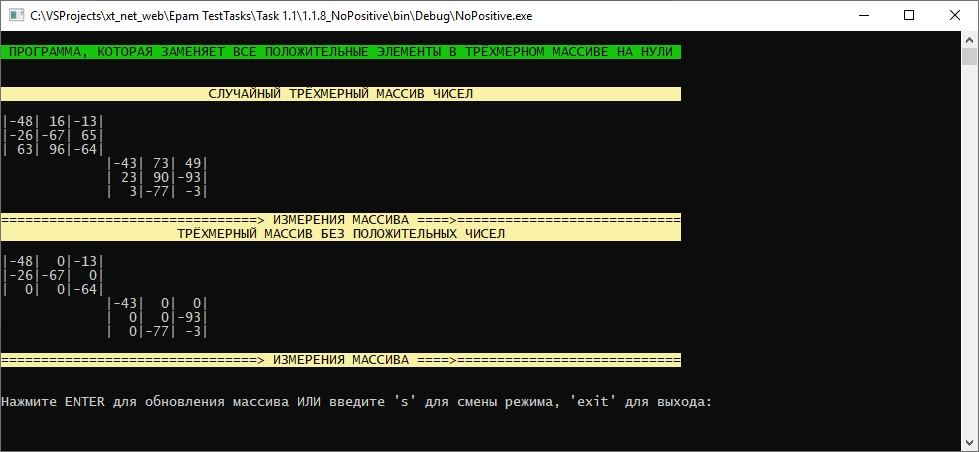
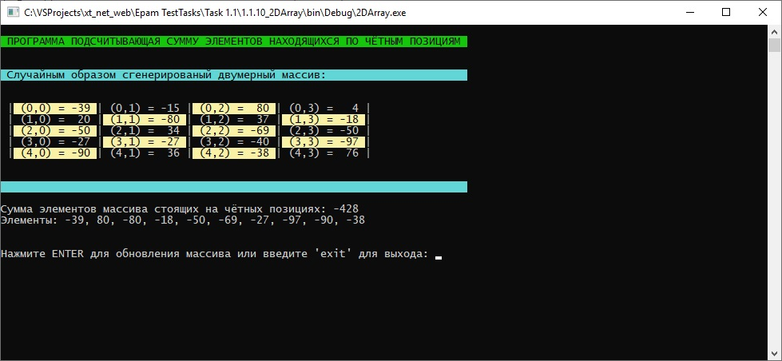

# Задания 1.1.х

[Остальные задания курса](https://github.com/IgorBrv/xt_net_web "Остальные задания курса")

# Задачи:

1.1.1	RECTANGLE

Написать программу, которая определяет площадь прямоугольника со сторонами a и b. Если пользователь вводит некорректные значения (отрицательные или ноль), должно выдаваться сообщение об ошибке. Возможность ввода пользователем строки вида «абвгд» или нецелых чисел игнорировать.

1.1.2.	TRIANGLE

Написать программу, которая запрашивает с клавиатуры число N и выводит на экран следующее «изображение», состоящее из N строк:

 
1.1.3.	ANOTHER TRIANGLE

Написать программу, которая запрашивает с клавиатуры число N и выводит на экран следующее «изображение», состоящее из N строк:

1.1.4.	X-MAS TREE

Написать программу, которая запрашивает с клавиатуры число N и выводит на экран следующее «изображение», состоящее из N треугольников:
 

1.1.5.	SUM OF NUMBERS

Если выписать все натуральные числа меньше 10, кратные 3 или 5, то получим 3, 5, 6 и 9. Сумма этих чисел будет равна 23. Напишите программу, которая выводит на экран сумму всех чисел меньше 1000, кратных 3 или 5.

1.1.6.	FONT ADJUSTMENT

Для форматирования текста надписи можно использовать различные начертания: полужирное, курсивное и подчёркнутое, а также их сочетания. Предложите способ хранения информации о форматировании текста надписи и напишите программу, которая позволяет устанавливать и изменять начертание:

 
1.1.7.	ARRAY PROCESSING

Написать программу, которая генерирует случайным образом элементы массива (число элементов в массиве и их тип определяются разработчиком), определяет для него максимальное и минимальное значения, сортирует массив и выводит полученный результат на экран.
Примечание: LINQ запросы и готовые функции языка (Sort, Max и т.д.) использовать в данном задании запрещается.

1.1.8.	NO POSITIVE

Написать программу, которая заменяет все положительные элементы в трёхмерном массиве на нули. Число элементов в массиве и их тип определяются разработчиком.

1.1.9.	NON-NEGATIVE SUM

Написать программу, которая определяет сумму неотрицательных элементов в одномерном массиве. Число элементов в массиве и их тип определяются разработчиком.

1.1.10.	2D ARRAY

Элемент двумерного массива считается стоящим на чётной позиции, если сумма номеров его позиций по обеим размерностям является чётным числом (например, [1,1] — чётная позиция, а [1,2] — нет).  Определить сумму элементов массива, стоящих на чётных позициях.

