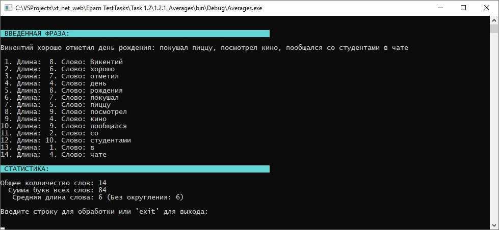

# Задания 1.2.х

[Остальные задания курса](https://github.com/IgorBrv/xt_net_web "Остальные задания курса")

# Задачи:

1.2.1. AVERAGES

Напишите программу, которая определяет среднюю длину слова во введённой текстовой строке. Учтите, что символы пунктуации на длину слов влиять не должны. Не стоит искать каждый символ-разделитель вручную: пожалейте своё время и используйте стандартные методы классов String и Char.
Регулярные выражения не использовать.
В случае дробного результата (х.5) – можете как оставить его таким, так и округлить. Стоит оставить комментарий в коде, указывающий, какое решение вы приняли.
Пример:
ВВОД: Викентий хорошо отметил день рождения: покушал пиццу, посмотрел кино, пообщался со студентами в чате
ВЫВОД: 6

1.2.2.	DOUBLER

Напишите программу, которая удваивает в первой введённой строке все символы, принадлежащие второй введённой строке.
Пример:

ВВОД 1: написать программу, которая
ВВОД 2: описание
ВЫВОД: ннааппииссаать ппроограамму, коотоораая

1.2.3.	LOWERCASE

Напишите программу, которая считает количество слов, начинающихся с маленькой буквы. Предлоги, союзы и междометия считаются словами. Финальную точку в предложении (как и любой другой знак) можно не учитывать.
Разделителем между словами считать ТОЛЬКО пробелы.

Дополнительное задание 1:

- Изменить программу, разделители между словами могут быть любые: запятые, двоеточия, точки с запятой.

Пример:

ВВОД: Антон выпил кофе и послушал Стинга
ВЫВОД: 4

Пример 2:

ВВОД: Антон хорошо начал утро: послушал Стинга, выпил кофе и посмотрел Звёздные Войны
ВЫВОД: 8

1.2.4.	VALIDATOR (Опциональное задание)

Напишите программу, которая заменяет первую букву первого слова в предложении на заглавную. В качестве окончания предложения можете считать только «.|?|!». Многоточие и «?!» можете опустить.

Пример:
ВВОД: я плохо учил русский язык. забываю начинать предложения с заглавной. хорошо, что можно написать программу!
ВЫВОД: Я плохо учил русский язык. Забываю начинать предложения с заглавной. Хорошо, что можно написать программу!

