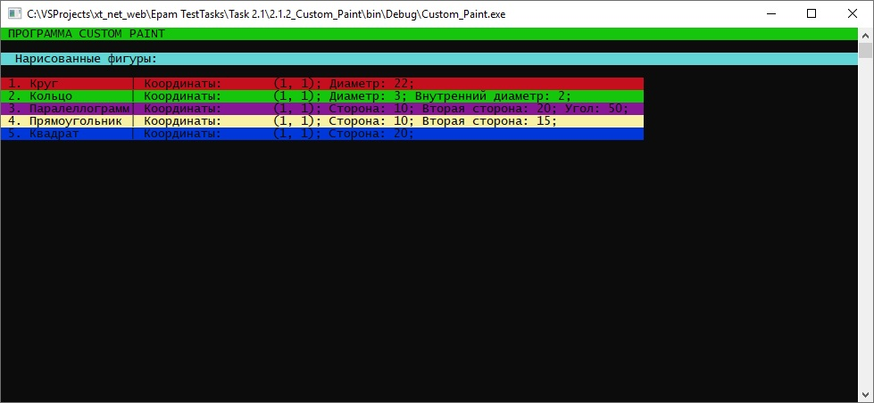

# Задания 2.1.х

[Остальные задания курса](https://github.com/IgorBrv/xt_net_web "Остальные задания курса")

# Задачи:

2.1.1.	CUSTOM STRING

Напишите собственный класс, описывающий строку как массив символов. Реализуйте для этого класса типовые операции (сравнение, конкатенация, поиск символов, конвертация из/в массив символов). Подумайте, какие функции вы бы добавили к имеющемуся в .NET функционалу строк (достаточно 1-2 функций).

Дополнительное задание 1:

- подумайте над использованием в своем классе функционала индексатора (indexer). Реализуйте его для своей строки. 

Дополнительное задание 2:

-  попробуйте создать из своей сборки переносимую библиотеку (DLL). Осмысленно назовите её, а также namespace и сам класс. Попробуйте использовать написанный вами класс в другом проекте.

2.1.2.	CUSTOM PAINT

Напишите класс, задающий круг с указанными координатами центра, радиусом, а также свойствами, позволяющими узнать длину описанной окружности и площадь круга. 
Кроме этого, создайте класс, описывающий кольцо, заданное координатами центра, внешним и внутренним радиусами, а также свойствами, позволяющими узнать площадь кольца и суммарную длину внешней и внутренней окружностей.
Подумайте над взаимосвязью этих сущностей, возможной иерархией. Задача – максимально сократить повтор кода в рамках задания.
По аналогии опишите классы других фигур. На их основе реализуйте собственный графический редактор, который взаимодействует с кольцами, окружностями, кругами, прямоугольниками, квадратами, треугольниками и линиями. 
Пользователю доступны следующие действия:

- добавить фигуру (предварительно введя её характеристики)
- вывести все фигуры на экран (вывести список фигур и их характеристик)
- очистить холст (удалить все фигуры)

Требование корректности характеристик фигур на каждом этапе неизменно, помните об этом!

Дополнительное задание 1:

- добавьте к приложению пользователей. Например, пользователь может вначале вводить имя, приложение, запрашивая действие, обращается по этому имени. Кроме опции «ВЫХОД» появляется опция «СМЕНИТЬ ПОЛЬЗОВАТЕЛЯ», требующая заново ввести имя.

Пример:

ВЫВОД: Выберите действие
1. Добавить фигуру
2. Вывести фигуры
3. Очистить холст
4. Выход

ВВОД: 1

ВЫВОД: Выберите тип фигуры:
…
ВВОД: 1

ВЫВОД: Введите параметры фигуры Круг
ВЫВОД: Введите координаты центра

ВВОД: …

ВЫВОД: Введите радиус

ВВОД: …

ВЫВОД: Фигура Круг создана! 
ВЫВОД: Выберите действие
…

