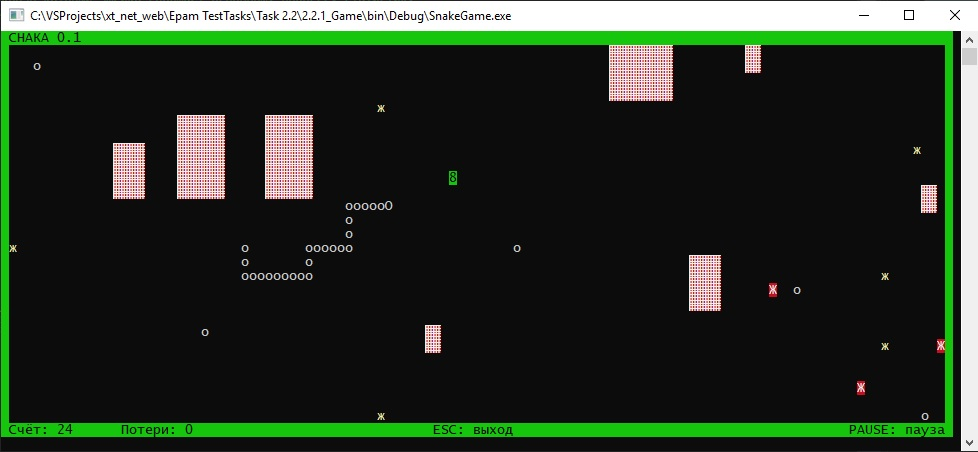

# Задания 2.2.х

[Остальные задания курса](https://github.com/IgorBrv/xt_net_web "Остальные задания курса")

# Задачи:

2.2.1.	GAME

Создайте иерархию классов и пропишите ключевые методы для компьютерной игры (без реализации функционала). Суть игры:
- Игрок может передвигаться по прямоугольному полю размером Width на Height;
- На поле располагаются бонусы (яблоко, вишня и т.д.), которые игрок может подобрать для поднятия каких-либо характеристик;
- За игроком охотятся монстры (волки, медведи и т.д.), которые могут передвигаться по карте по какому-либо алгоритму;
- На поле располагаются препятствия разных типов (камни, деревья и т.д.), которые игрок и монстры должны обходить.

Цель игры — собрать все бонусы и не быть «съеденным» монстрами.
При желании объекты-бонусы могут быть заменены вами на аналогичные (патроны, канистры с бензином, монетки), также, как и враги (роботы, мумии, зомби). Включайте фантазию!

Дополнительное задание 1:

- подумайте над реализацией консольного геймплея вашей игры. Как он может выглядеть? Каким образом отрисовать поле? Добавьте классы визуализации поля, препятствий, врагов и бонусов на нём.

Дополнительное задание 2:

- попробуйте сделать играбельную версию вашего проекта. На данном этапе не стоит заморачиваться над балансом, интересностью геймплея или удобством.

