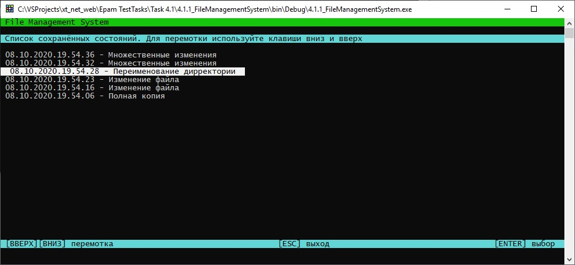

# Задание 4.1.1

[Остальные задания курса](https://github.com/IgorBrv/xt_net_web "Остальные задания курса")

# Задача:

4.1.1	FILE MANAGEMENT SYSTEM

Дана папка, которая является хранилищем файлов. 
Для всех текстовых файлов (*.txt), находящихся в этой папке или вложенных подпапках, реализовать сохранение истории изменений с возможностью отката состояния к любому моменту.
Принцип работы программы:
- При запуске программа спрашивает пользователя, какой из режимов он хочет включить: наблюдения или отката изменений. Как вариант, можно использовать ключи командной строки.
- При выборе режима наблюдения все происходящие с текстовыми файлами изменения логируются до момента закрытия программы. Как вариант, можно создавать на диске в отдельной папке копии файлов по состоянию на момент изменения.
- При выборе режима отката изменений пользователь вводит дату и время, на которые должен быть осуществлён откат, после чего все текстовые файлы в папке должны принять вид, соответствующий указанному времени.
Возможностью изменения файлов в момент, когда программа не находится в режиме отслеживания изменений, пренебречь.

