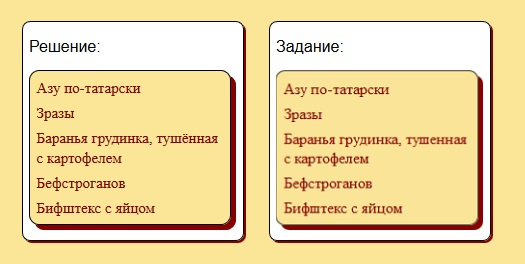

# Задание 6.1

[Остальные задания курса](https://github.com/IgorBrv/xt_net_web "Остальные задания курса")

[Просмотреть результат выполнения онлайн](http://htmlpreview.github.io/?https://github.com/IgorBrv/xt_net_web/blob/master/Epam%20TestTasks/Task%206.0/Task%206.1/index.html "Просмотреть результат выполнения онлайн")

# Задание:

6.1.LIST MENU

Сверстайтеменю, показанное на рисунке ниже, на HTML5 с помощью тегов ul и li. Ширина меню должна быть фиксирована и равна 200px.

