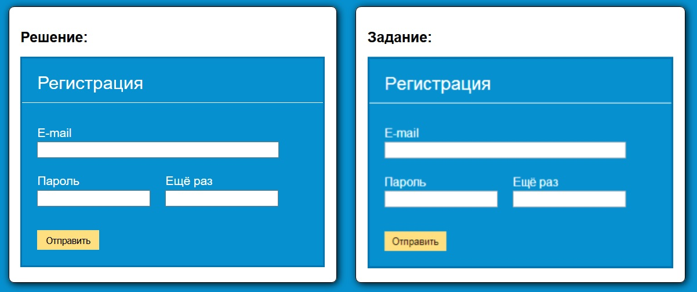

# Задание 6.2

[Остальные задания курса](https://github.com/IgorBrv/xt_net_web "Остальные задания курса")

[Просмотреть результат выполнения онлайн](http://htmlpreview.github.io/?https://github.com/IgorBrv/xt_net_web/blob/master/Epam%20TestTasks/Task%206.0/Task%206.2/index.html "Просмотреть результат выполнения онлайн")

# Задание:

6.2.REGISTRATION FORM

Сверстайте форму регистрации, показанную на рисунке ниже. Ширина формы и её полей должна быть фиксирована.

