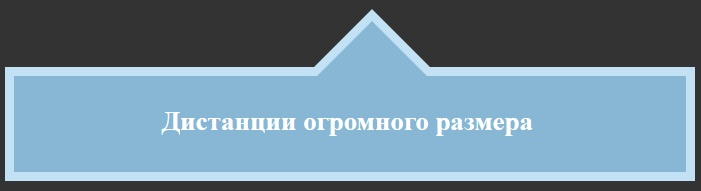

# Задание 6.3

[Остальные задания курса](https://github.com/IgorBrv/xt_net_web "Остальные задания курса")

[Просмотреть результат выполнения онлайн](http://htmlpreview.github.io/?https://github.com/IgorBrv/xt_net_web/blob/master/Epam%20TestTasks/Task%206.0/Task%206.3/index.html "Просмотреть результат выполнения онлайн")

# Задание:

6.3.POINTING BLOCK

Сверстайте страницу как показано на рисунке. Ширина блока резиновая и меняется в зависимости от размеров окна браузера. Указатель всегда располагается посередине блока, размеры указателя фиксированы.

