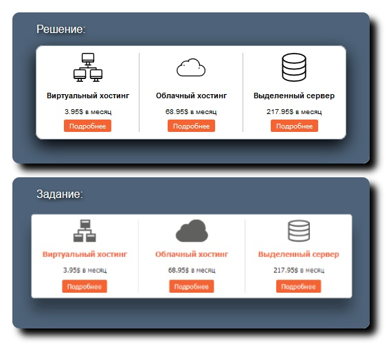

# Задание 6.4

[Остальные задания курса](https://github.com/IgorBrv/xt_net_web "Остальные задания курса")

[Просмотреть результат выполнения онлайн](http://htmlpreview.github.io/?https://github.com/IgorBrv/xt_net_web/blob/master/Epam%20TestTasks/Task%206.0/Task%206.4/index.html "Просмотреть результат выполнения онлайн")

# Задание:

6.4.THREE COLUMN BLOCK

Создайте страницу, показанную на рис. Ширина блока фиксирована. Выравнивание – по центру.

