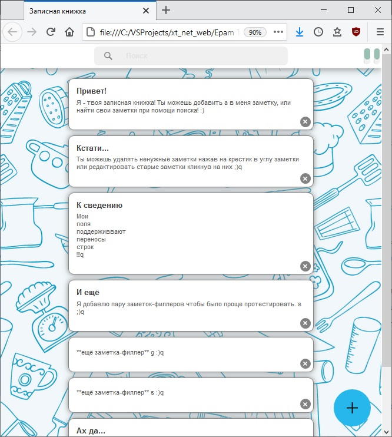

# Задание 6.5

[Остальные задания курса](https://github.com/IgorBrv/xt_net_web "Остальные задания курса")

[Просмотреть результат выполнения онлайн](http://htmlpreview.github.io/?https://github.com/IgorBrv/xt_net_web/blob/master/Epam%20TestTasks/Task%206.0/Task%206.5/index.html "Просмотреть результат выполнения онлайн")

# Задание:

6.5.G-KEEP

Создайте упрощенную версию googlekeep.
Для работы с заметками используйте некоторые методы библиотеки, которую вы создали в прошлом задании.

ОБЯЗАТЕЛЬНЫЕ ТРЕБОВАНИЯ:
Заметка описывается следующими характеристиками:
 - Заголовок — string
 - Текст заметки (описание) — string
 
Действия, производимые со списком заметок:

- Добавление заметки
- Изменение заметки
- Удаление заметки

Добавление заметки: При нажатии на кнопку “+”, открывается модальное окно, производится заполнение полей и нажатие кнопки “Создать”. После нажатия кнопки “Создать”, заметка добавляется в начало списка.

Изменение заметки: Чтобы выбрать заметку на изменение, необходимо нажать на заметку. После нажатия на заметку происходит следующие: Открывается модальное окно, в поля записываются значения свойств заметки, выбранной на редактирование.Для изменения заметки необходимо заполнить поля и нажать кнопку “Сохранить”. После нажатия кнопки “Сохранить”, заметка помещается в начало списка. 

Удаление заметки: Для удаления заметки необходимо нажать кнопку “удалить” на заметке. После нажатия появляется всплывающее окно (confirm), запрашивающее подтверждение удаления заметки. При подтверждении происходит удаление заметки. При отмене ничего не происходит.

ОПЦИОНАЛЬНЫЕ ТРЕБОВАНИЯ (Являются необязательными):
Фильтрация заметок (Регистронезависимая): Фильтрация происходит по названию заметки и её содержимому.Фильтрация выполняется путем заполнения поля для поиска и нажатия кнопки “Search”. Если поле для поиска пустое, по клику на кнопкуничего не происходит. Если ни одна заметка не удовлетворяет условиям фильтрации, список выводится пустой.

