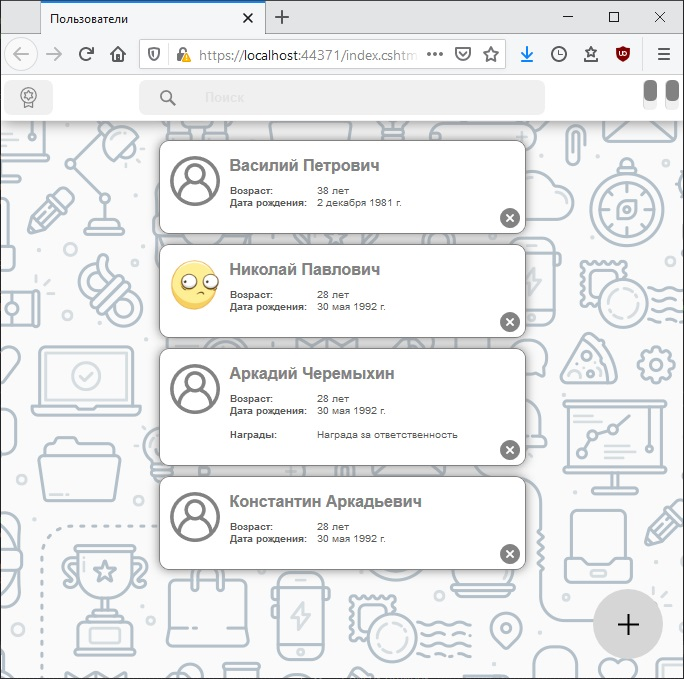

# Задания 7.2.х

[Остальные задания курса](https://github.com/IgorBrv/xt_net_web "Остальные задания курса")

# Задание:

7.2.1.	ROLES

Добавить в приложение (написаное в 7.1.х) ролевую модель. Предусмотреть окно входа в систему и окно регистрации нового пользователя. Права групп:
    •	Анонимные пользователи (гости) — запрет пользования приложением, переброс на страничку логина. Возможность зарегистрироваться.
    •	Зарегистрированные пользователи — просмотр перечня «пользователей» и вручённых им наград, просмотр перечня наград;
    •	Администраторы — просмотр и редактирование перечня «пользователей» и вручённых им наград, просмотр и редактирование перечня наград;
Модуль аутентификации должен быть написан с возможностью последующей замены его на другую реализацию.

7.2.2.	DATABASE

Реализовать базу данных Microsoft SQL Server для хранения данных приложения. База данных должна быть приведена к третьей нормальной форме.
Желательно (но не обязательно) написать хранимые процедуры для операций над данными.
Написать реализацию DAL для приложения, основанную на созданной БД. В качестве технологии доступа использовать присоединённую модель ADO.NET.
    •	Ранее написанная архитектура не должна подвергаться изменениям;
    •	Допускается изменение ранее написанного кода с целью исправления ошибок;
    •	Работоспособность предыдущей версии DAL не должна пострадать;
    •	Выбор используемой реализации DAL определяется на основании значения параметра в файле конфигурации.

