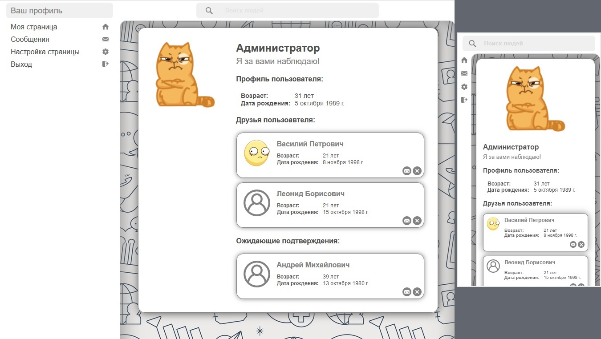

# Финальное задание курса EPAM .NET BASICS

ВНИМАНИЕ: встроенные учётные записи - admin@mail.ru/admin2@mail.ru/admin3@mail.ru, пароль admin

[Остальные задания курса](https://github.com/IgorBrv/xt_net_web "Остальные задания курса")

# Задание:

- Не менее 4 –5 сценариев использования.
- Технология ASP.NET WebPages.
- Страницы должны содержать элементы пользовательского интерфейса, сгенерированные и сгруппированные с помощью частичных страниц (partial pages), шаблонов (layout) и, при необходимости, секций (sections).
- Наличие клиентского JavaScript и валидации ввода.
- Желательно наличие AJAX, responsive вёрстки.
- Аутентификация на основе Forms, поддержка ролей пользователей, без использования Membership и стандартной базы данных membership.
- Многоуровневая архитектура проекта.
- Собственная база данных со связями между таблицами (желательно нормализовать до третьей нормальной формы). В качестве уровня доступа создать собственный DAL на ADO.NET. EntityFramework и прочие ORM не использовать.
- Должно быть протоколирование исключительных ситуаций (log4net или Microsoft Enterprise Logger) и корректная обработка ошибок c переадресацией на Error page в случае фатальной ошибки при работе приложения.
 
# Выбранная тема:
- Простая социальная сеть. Регистрация  пользователей.  Настройка  персональной информации. «Друзья» пользователя. Обмен сообщений с другими пользователями. Поиск  пользователей  по  определённым  критериям. Управление  пользователями. Модерирование сообщений.

